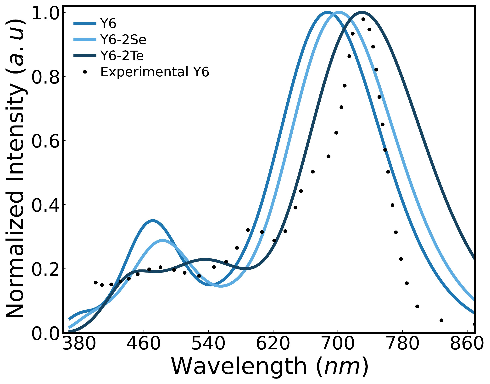
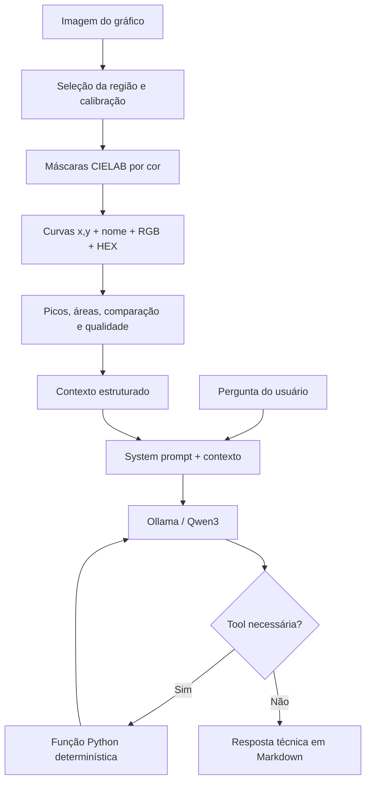
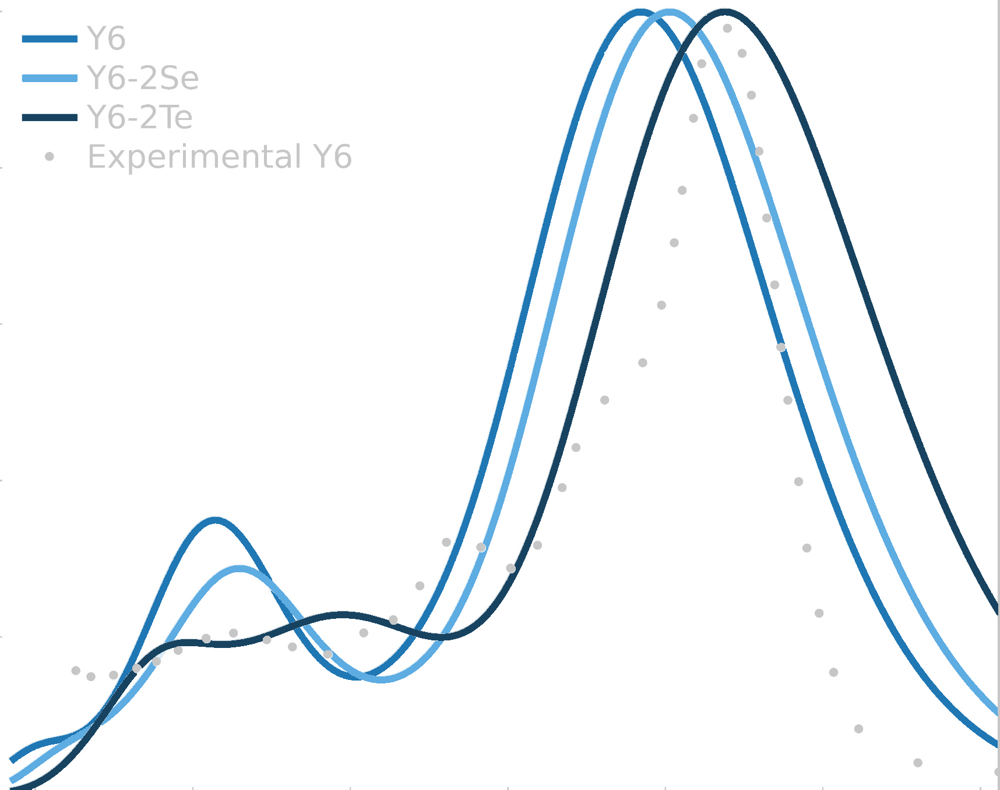
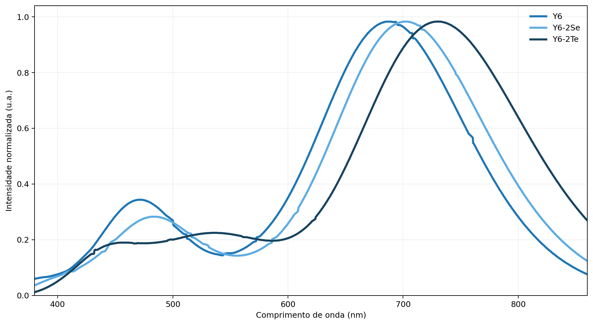
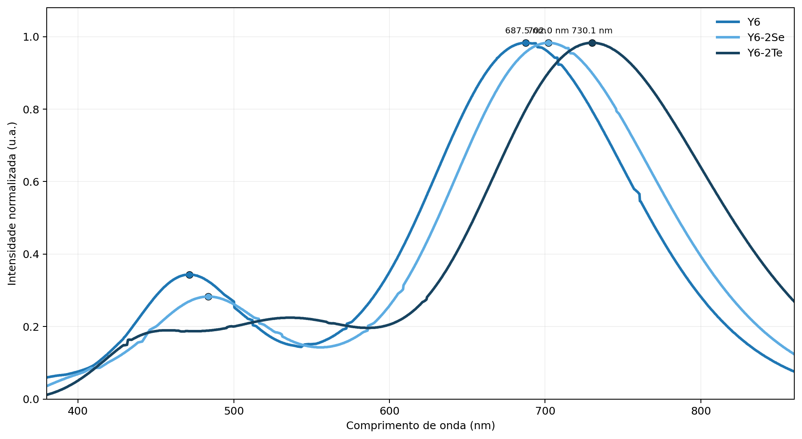

# SpectraCurve Lab — digitalização multicolor e interpretação com IA generativa local

O **SpectraCurve Lab** é uma aplicação Streamlit que digitaliza curvas científicas presentes em imagens, reconstrói os dados numéricos, detecta picos e usa um modelo local executado pelo **Ollama** para produzir uma interpretação técnica fundamentada em ferramentas determinísticas.

A aplicação foi desenvolvida como projeto final da disciplina de **IA Generativa**, com foco explícito em decisões de engenharia de LLM: system prompt, parâmetros, tool calling, escolha de framework, segurança e rastreabilidade.



## Funcionalidades principais

- upload de imagens de espectros e gráficos científicos;
- suporte a Absorção/UV-Vis, Raman e FTIR;
- calibração manual dos eixos;
- extração de curva única ou múltiplas curvas;
- seleção manual de várias cores ou detecção automática;
- máscara CIELAB independente para cada cor selecionada;
- armazenamento de nome, ordem, RGB e HEX de cada curva;
- reconstrução dos dados em coordenadas científicas;
- detecção determinística de picos e bandas;
- exportação CSV e relatório técnico;
- assistente local com Ollama e sete tools;
- rastreamento das tools, argumentos, resultados, tokens e duração.

> **Princípio de projeto:** o LLM não calcula nem inventa valores. Extração, calibração, áreas, picos, comparação e qualidade são calculados em Python. O modelo apenas seleciona ferramentas e transforma os resultados em linguagem natural.

---

## 1. Problema e solução

Muitos dados científicos são disponibilizados apenas como imagens em artigos, relatórios e apresentações. Isso dificulta comparações quantitativas, reanálises e reutilização dos dados.

O SpectraCurve Lab adota uma arquitetura híbrida:

1. **Camada determinística:** processa a imagem, separa cores, rastreia curvas, calibra os eixos e calcula métricas.
2. **Camada generativa:** interpreta os resultados estruturados por meio de um modelo local e de tool calling.

Essa divisão reduz alucinações e mantém os resultados auditáveis.

---

## 2. Arquitetura de LLM



### Fluxo do agente

1. A pergunta é delimitada em `<user_request>`.
2. O contexto mínimo é enviado em `<analysis_context>`.
3. O modelo recebe os schemas das tools.
4. O modelo solicita uma ou mais funções.
5. As funções retornam JSON determinístico.
6. O resultado volta ao modelo.
7. O ciclo é limitado a quatro rodadas.
8. A interface exibe resposta e rastreamento.

---

## 3. Reconhecimento de múltiplas curvas e cores

No modo **Múltiplas curvas por cor**, o usuário pode selecionar várias cores ou solicitar detecção automática.

Na seleção manual, cada curva recebe:

```json
{
  "ordinal": 1,
  "name": "Y6",
  "color_label": "azul",
  "rgb": [31, 119, 180],
  "hex": "#1F77B4",
  "selection_mode": "manual"
}
```

A imagem é convertida para **CIELAB**. Cada pixel é atribuído à cor selecionada perceptualmente mais próxima, desde que esteja dentro da tolerância configurada. A atribuição por vizinho mais próximo evita que um mesmo pixel pertença a duas curvas.



O rastreamento usa um caminho contínuo por coluna, reduzindo saltos para legendas, símbolos ou ruídos. As cores originais são preservadas no gráfico reconstruído e no catálogo enviado às tools.

### Caso difícil: pontos experimentais pretos

Na imagem de teste, os pontos experimentais pretos compartilham cor com eixos, textos e moldura. Eles não foram incluídos no teste automático das curvas coloridas, porque uma máscara preta simples capturaria esses elementos. Esse caso exige uma etapa específica de detecção de marcadores ou seleção manual de região e permanece como melhoria futura.

---

## 4. Modelo, provedor e framework

### Provedor: Ollama local

O Ollama foi escolhido porque:

- não exige chave de API;
- não gera cobrança por chamada;
- mantém os dados na máquina local;
- suporta tool calling;
- permite trocar o modelo sem alterar a arquitetura.

### Modelo padrão: `qwen3:1.7b`

A escolha prioriza equilíbrio entre qualidade, memória e latência em hardware limitado.

| Modelo | Uso | Trade-off |
|---|---|---|
| `qwen3:0.6b` | hardware muito limitado | menor robustez e qualidade |
| `qwen3:1.7b` | padrão do projeto | equilíbrio entre custo computacional e capacidade |
| `qwen3:4b` | respostas mais robustas | maior consumo de RAM/VRAM e latência |

### Framework: SDK oficial do Ollama

Foi utilizado o SDK oficial diretamente, sem LangChain ou LangGraph.

**Justificativa:** a aplicação possui um único agente, sete ferramentas locais e nenhuma necessidade de grafo complexo, memória persistente ou multiagente. A chamada direta reduz dependências e deixa o loop de tools transparente para inspeção e depuração.

---

## 5. System prompt e estratégia de prompting

O prompt principal está em:

```text
prompts/system_prompt.txt
```

Ele contém:

- persona técnica `Assistente SpectraCurve`;
- objetivo e escopo;
- tools como fonte primária de verdade;
- proibição de inventar picos, áreas e identidades químicas;
- regras específicas para UV-Vis, Raman e FTIR;
- separação entre fatos, hipóteses e limitações;
- formato de saída em Markdown;
- proteção básica contra prompt injection;
- regras para preservar nome, cor, RGB, HEX e ordem das curvas.

### Técnicas utilizadas

- **tags XML** para separar papel, regras, fluxo e saída;
- **few-shot** em `prompts/few_shot_examples.json`;
- delimitação do input em `<analysis_context>` e `<user_request>`;
- instrução explícita para consultar tools antes de afirmar números;
- fallback determinístico quando o modelo não chama uma ferramenta;
- não exibição do campo interno de reasoning/thinking.

---

## 6. Tools disponibilizadas ao modelo

As tools estão em:

```text
tools/spectral_tools.py
```

| Tool | Função | Justificativa |
|---|---|---|
| `get_analysis_context` | fornece tipo de espectro, arquivo, calibração e curvas | evita enviar dados brutos desnecessários |
| `list_detected_curves` | lista ordem, nome, cor, RGB e HEX | mantém a identidade das séries |
| `get_curve_by_color` | resolve “azul”, “segunda curva”, RGB ou HEX | evita seleção da curva errada |
| `get_curve_summary` | retorna limites, número de pontos e área | impede estimativas do LLM |
| `get_detected_peaks` | retorna apenas picos calculados | evita invenção de bandas |
| `compare_curves` | calcula correlação, RMSE, MAE e áreas | substitui comparação visual subjetiva |
| `get_extraction_quality` | informa cobertura e continuidade | fundamenta recomendações de ajuste |

Os schemas possuem parâmetros tipados, enumeração dinâmica dos nomes válidos, `additionalProperties: false` e tratamento de erros.

### Garantia de fonte determinística

O Ollama não expõe um equivalente direto a `tool_choice="required"`. Por isso:

1. o system prompt exige consulta a tools;
2. todas as tools são fornecidas em cada rodada;
3. se nenhuma tool for chamada, a aplicação executa `get_analysis_context`;
4. o fallback é marcado como `application_fallback`;
5. o modelo recebe o resultado e pode continuar o fluxo.

---

## 7. Parâmetros do modelo

| Parâmetro | Padrão | Justificativa |
|---|---:|---|
| Modelo | `qwen3:1.7b` | equilíbrio para hardware limitado |
| Temperatura | `0.2` | reduz variação em análise técnico-científica |
| Top-p | `0.9` | mantém flexibilidade moderada na redação |
| Thinking | `False` | reduz latência e não expõe raciocínio interno |
| `num_predict` | `1000` | limita respostas excessivas |
| `num_ctx` | `4096` | suficiente para prompt, schemas e resultados |
| Máximo de rodadas | `4` | evita loops indefinidos |
| `keep_alive` | `5m` | reduz recarga entre perguntas consecutivas |
| Streaming | `False` | simplifica rastreamento das tools |

O protocolo de comparação de temperatura, top-p e modelo está em `docs/experimentos_llm.md`. O script `scripts/run_llm_experiments.py` executa os experimentos automaticamente em uma máquina com Ollama ativo.

---

## 8. Teste real com imagem multicolor

A imagem `examples/Fig3-a.jpg` contém três curvas coloridas e uma série de pontos experimentais pretos.

### Cores selecionadas

| Curva | RGB selecionado | HEX |
|---|---|---|
| Y6 | `(31, 119, 180)` | `#1F77B4` |
| Y6-2Se | `(93, 172, 226)` | `#5DACE2` |
| Y6-2Te | `(23, 67, 96)` | `#174360` |

### Resultados obtidos automaticamente

| Curva | Cobertura horizontal | Qualidade | Máximo principal |
|---|---:|---|---:|
| Y6 | 98,31% | Alta | 687,47 nm |
| Y6-2Se | 96,91% | Alta | 701,97 nm |
| Y6-2Te | 98,78% | Alta | 730,09 nm |

As máscaras não apresentaram sobreposição. A ordem dos máximos principais foi:

```text
Y6 < Y6-2Se < Y6-2Te
```

Isso é coerente com o deslocamento visual das curvas para maiores comprimentos de onda.





Arquivos de resultados:

```text
docs/results/real_image_test_report.json
docs/results/real_image_summary.csv
docs/results/real_image_quality.csv
docs/results/real_image_peaks.csv
```

---

## 9. Testes automatizados

Instale as dependências de desenvolvimento:

```bash
pip install -r requirements-dev.txt
```

Execute:

```bash
python -m pytest -q
```

Resultado obtido na preparação da entrega:

```text
8 passed
```

Os testes verificam:

- schemas das tools;
- resumo e comparação de curvas;
- erro seguro para curva inexistente;
- máscaras independentes para cores selecionadas;
- resolução por nome, cor, HEX e ordem;
- ciclo de tool calling com cliente Ollama simulado;
- propagação dos parâmetros ao SDK;
- coleta de métricas de uso;
- integração real com a imagem multicolor;
- cobertura acima de 95%;
- ordem correta dos máximos principais.

### Limite da validação neste pacote

Os testes unitários e a integração determinística foram executados. Uma inferência real com o modelo local depende de um servidor Ollama e de modelos instalados na máquina de execução. Para gerar o relatório empírico de temperatura, top-p e modelos:

```bash
ollama serve
ollama pull qwen3:0.6b
ollama pull qwen3:1.7b
python scripts/run_llm_experiments.py
```

O script gera:

```text
docs/results/ollama_experiments.json
docs/results/ollama_experiments.md
```

---

## 10. O que funcionou

- As três curvas coloridas foram separadas em máscaras não sobrepostas.
- Nome, RGB e HEX permaneceram associados durante extração e reconstrução.
- A cobertura horizontal ficou entre 96,9% e 98,8%.
- Os máximos principais foram recuperados em ordem coerente com a figura original.
- A divisão entre cálculo determinístico e interpretação generativa tornou o fluxo rastreável.
- O agente executou corretamente o ciclo de tools nos testes com cliente simulado.
- O projeto não exige API paga nem chave secreta.

---

## 11. O que não funcionou ou permanece limitado

- Pontos experimentais pretos não são separados automaticamente de eixos e textos pretos.
- Curvas de cores muito próximas exigem ajuste da tolerância CIELAB.
- Curvas com a mesma cor precisam de rastreamento geométrico mais avançado.
- Modelos locais pequenos podem ignorar uma tool ou responder de forma superficial.
- O fallback garante contexto determinístico, mas não substitui a seleção ideal da tool.
- O modelo não possui uma biblioteca espectroscópica validada.
- Atribuições químicas permanecem hipóteses sem estrutura molecular ou referência.
- A proteção contra prompt injection reduz risco, mas não é absoluta.
- A latência depende do hardware e da quantização do modelo.

---

## 12. Segurança e privacidade

- execução local sem chave de API;
- tools como fonte dos valores numéricos;
- limite de rodadas;
- argumentos validados;
- erros retornados em JSON;
- input delimitado como conteúdo não confiável;
- thinking não exibido;
- nenhum segredo salvo no repositório.

> Ao usar um servidor Ollama remoto, os dados passam a ser enviados para esse servidor e a segurança depende da infraestrutura configurada.

---

## 13. Estrutura do repositório

```text
spectracurve-lab/
├── app.py
├── README.md
├── agents/
│   └── spectral_agent.py
├── prompts/
│   ├── system_prompt.txt
│   └── few_shot_examples.json
├── tools/
│   └── spectral_tools.py
├── utils/
├── scripts/
│   └── run_llm_experiments.py
├── tests/
│   ├── test_multicolor_extraction.py
│   ├── test_real_multicolor_example.py
│   ├── test_spectral_agent.py
│   └── test_spectral_tools.py
├── docs/
│   ├── images/
│   ├── results/
│   ├── experimentos_llm.md
│   ├── fluxo_da_aplicacao.md
│   ├── limitacoes.md
│   └── roteiro_apresentacao.md
└── examples/
    └── Fig3-a.jpg
```

---

## 14. Instalação e execução no Ubuntu

### Instalar o Ollama

```bash
curl -fsSL https://ollama.com/install.sh | sh
ollama serve
```

### Baixar o modelo

```bash
ollama pull qwen3:1.7b
```

### Instalar o projeto

```bash
python -m venv .venv
source .venv/bin/activate
pip install -r requirements.txt
```

### Executar

```bash
python -m streamlit run app.py
```

Acesse:

```text
http://localhost:8501
```

---

## 15. Como reproduzir o teste da imagem

O teste automatizado está em:

```text
tests/test_real_multicolor_example.py
```

Execute apenas esse teste:

```bash
python -m pytest tests/test_real_multicolor_example.py -q
```

Os CSVs e gráficos já gerados estão em `docs/results/` e `docs/images/`.

---

## 16. Deploy

A execução principal é local. Em hospedagem pública, `localhost:11434` aponta para o servidor do deploy, não para o computador do usuário. Portanto, seria necessário:

1. instalar Ollama no mesmo servidor/container; ou
2. configurar um servidor Ollama remoto acessível pela aplicação.

O endpoint público não é obrigatório para esta avaliação.

---

## 17. Referências técnicas

- Ollama API: <https://docs.ollama.com/api/introduction>
- Tool calling: <https://docs.ollama.com/capabilities/tool-calling>
- Qwen3 no Ollama: <https://ollama.com/library/qwen3>
- SDK Python: <https://github.com/ollama/ollama-python>

---

## Autor

**Rafael de Oliveira Lima**

Projeto desenvolvido para a avaliação final da disciplina de IA Generativa.
